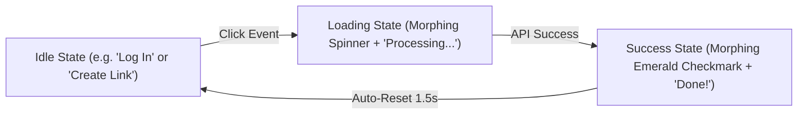

# DESIGN.md — Xoru Design System & Motion Specification

**Tagline**: *Short Link. Real Intelligence.*  
**Design Philosophy**: Anti-Slop Modern SaaS UI, powered by Taste Skill + Impeccable Design Standards. Clean card layouts, sharp typography contrast, hardware-accelerated motion, and fluid micro-interactions.

---

## 1. Brand Identity & Color Palette

### Primary Brand Color: Indigo
- **Brand Primary (`#4F46E5`)**: Tailwind `indigo-600` — Primary action buttons, active navigation tabs, glowing focus rings, key metric highlights.
- **Brand Hover (`#4338CA`)**: Tailwind `indigo-700` — Button hover state.
- **Brand Light Accent (`#EEF2FF`)**: Tailwind `indigo-50` — Badge backgrounds, selected row highlights, subtle tint fills.
- **Brand Border Glow (`#818CF8`)**: Tailwind `indigo-400` — Active input border & glow rings.

### Neutral Surface & Scale (Light / Dark Adaptive)
- **Background App**: `#F8FAFC` (Tailwind `slate-50`) / Dark `#0F172A` (Tailwind `slate-900`)
- **Card / Surface**: `#FFFFFF` / Dark `#1E293B` (Tailwind `slate-800`)
- **Border Neutral**: `#E2E8F0` (Tailwind `slate-200`) / Dark `#334155` (Tailwind `slate-700`)
- **Text Heading**: `#0F172A` (Tailwind `slate-900`) / Dark `#F8FAFC`
- **Text Body**: `#334155` (Tailwind `slate-700`) / Dark `#CBD5E1`
- **Text Muted**: `#64748B` (Tailwind `slate-500`) / Dark `#94A3B8`

### Semantic Feedback Colors
- **Success**: Emerald (`#10B981` / `emerald-500`) — Link created, copied, checkmark morph state.
- **Error / Destructive**: Rose (`#F43F5E` / `rose-500`) — Link deleted, validation errors, expired links.
- **Warning**: Amber (`#F59E0B` / `amber-500`) — Broken destination link warning, rate limit alert.
- **Info**: Sky (`#0EA5E9` / `sky-500`) — Analytics tooltips, tag pills.

---

## 2. Typography & Hierarchy

### Font Family
- **Primary Typography**: **Open Sans** (`next/font/google`)
- **Monospace Typography**: `JetBrains Mono` / `ui-monospace` (Used for Short Codes, Slugs, API Keys, and IP Hashes).

### Font Scale & Hierarchy
| Token | Size | Weight | Line Height | Application |
| :--- | :--- | :--- | :--- | :--- |
| `display-lg` | 36px (`text-4xl`) | Bold (700) | 1.1 | Landing Hero Headings |
| `heading-1` | 28px (`text-3xl`) | SemiBold (600) | 1.2 | Page Titles, Dashboard Header |
| `heading-2` | 20px (`text-xl`) | SemiBold (600) | 1.3 | Card Titles, Modal Headers |
| `heading-3` | 16px (`text-base`) | SemiBold (600) | 1.4 | Table Headers, Section Labels |
| `body-md` | 14px (`text-sm`) | Regular (400) | 1.5 | Main Body Copy, Table Rows, Input Text |
| `caption` | 12px (`text-xs`) | Medium (500) | 1.4 | Badges, Timestamp Labels, Subtext |
| `code-slug` | 13px (`text-[13px]`) | SemiBold (600) | 1.4 | Short link URLs e.g. `xoru.link/a9x2k` |

---

## 3. Layout Geometry, Spacing & Border Radius

### Border Radius Scale
- **`rounded-md` (6px)**: Badges, small tag pills, tooltips.
- **`rounded-lg` (8px)**: Form inputs, textareas, dropdown menus, button sub-elements.
- **`rounded-xl` (12px)**: Primary buttons, Action Cards, Link item rows.
- **`rounded-2xl` (16px)**: Dashboard Containers, Modal Dialogs, Floating Panels.

### Spacing & Grid Rhythm
- **Page Container Padding**: `px-4 sm:px-6 lg:px-8 max-w-7xl mx-auto`
- **Card Padding**: `p-5 sm:p-6`
- **Component Gap**: `gap-3` (tight controls), `gap-6` (card grids), `gap-8` (page sections).

---

## 4. Iconography Standards

- **Icon Set**: **Lucide Icons** (`lucide-react`).
- **Stroke Width**: `1.75px` default (delivers clean contrast with Open Sans).
- **Sizing Tokens**:
  - Small: `16px` (`w-4 h-4`) — Inside buttons, badges, table cells.
  - Medium: `20px` (`w-5 h-5`) — Card headers, navigation items.
  - Large: `24px` (`w-6 h-6`) — Modal icons, feature heroes.

---

## 5. Micro-Interactions & State Morphing Specification

Every interactive element in Xoru must feel tactile, responsive, and delightful through fluid micro-motion.

### A. Button State Morphing (Interactive State Machine)
Buttons transition seamlessly between 3 distinct states without abrupt layout shifts:

#### State Transition Rules:
1. **Idle State**:
   - Styling: Indigo background (`bg-indigo-600 hover:bg-indigo-700 text-white shadow-sm`).
   - Micro-interaction: Scale down on click (`active:scale-[0.98] transition-transform duration-150`).
2. **Loading State**:
   - Text & Icon morphing: Text fades out slightly (`opacity-0 scale-95 transition-all duration-200 absolute`), while a centered CSS/Lucide `Loader2` spinner rotates into view (`animate-spin opacity-100 scale-100 transition-all duration-200`).
   - Button behavior: Disabled, pointer-events-none, pulse animation background tint.
3. **Success State**:
   - Morph animation: Button background transitions smoothly from Indigo to Emerald (`bg-emerald-600 transition-colors duration-300`).
   - Icon animation: Checkmark icon springs into view (`scale-110 rotate-0 transition-all duration-300 ease-out-back`).
   - Reset: Holds success checkmark for `1500ms`, then morphs back to Idle state.

### B. Interactive Card & Row Hovers
- **Link Rows & Cards**: `transition-all duration-200 ease-out hover:-translate-y-0.5 hover:shadow-md hover:border-indigo-200/80`
- **Copy Link Button**: One-click action triggers a floating "Copied to Clipboard!" tooltip pop-in with a scale bounce (`animate-in zoom-in-95 duration-150`).

### C. Form Field Focus & Validation Ring
- **Focus Ring**: `focus:outline-none focus:ring-2 focus:ring-indigo-500/40 focus:border-indigo-500 transition-all duration-150`
- **Error State Shake**: Invalid input submit triggers a subtle 3px horizontal spring shake animation (`animate-shake`).

### D. Custom Modals & Dialog System (NO Browser Native Dialogs)

> [!IMPORTANT]
> **Strict Prohibition**: Native browser popups (`window.alert()`, `window.confirm()`, `window.prompt()`, or unstyled browser `<dialog>` elements) are strictly forbidden across the entire application. All dialogs, popovers, and confirmations must use Xoru custom UI components.

1. **Backdrop Layer**:
   - High-grade glassmorphism blur: `backdrop-blur-md bg-slate-900/50 transition-opacity duration-200`.
   - Clicking backdrop triggers smooth modal dismiss (if non-critical).
2. **Dialog Container**:
   - Styled with `rounded-2xl` (16px border-radius), crisp border (`border border-slate-200 dark:border-slate-800`), and deep shadow (`shadow-2xl shadow-indigo-950/10`).
   - Entrance animation: Scale spring-in (`animate-in fade-in-0 zoom-in-95 duration-200 ease-out`).
   - Exit animation: Fade and scale out (`animate-out fade-out-0 zoom-out-95 duration-150 ease-in`).
3. **Custom Confirmation Dialogs**:
   - **Destructive Action (e.g. Delete Short Link)**: Custom confirmation modal with Rose warning icon pill, clear descriptive text, and a morphing "Delete Link" button (`bg-rose-600 hover:bg-rose-700`).
   - **Form Unsaved Changes**: Custom modal asking "Discard unsaved changes?" with explicit "Keep Editing" and "Discard" custom buttons.
4. **Keyboard & Accessibility**:
   - Focus lock within open dialog.
   - `Escape` key smoothly closes modal.

### E. Toasts & Floating Notifications
- **Toast Notifications**: Slide in from top-right with `translate-x` spring, auto-dismiss with progress bar indicator (`animate-in slide-in-from-top-2 fade-in duration-200`).

---

## 6. Uniform UI/UX Compliance Checklist

Before shipping any UI component or page:
- [ ] Uses Indigo (`indigo-600` / `#4F46E5`) for primary CTA and brand accents.
- [ ] Typography uses **Open Sans** (`font-sans`) and JetBrains Mono for short codes/slugs.
- [ ] Border radius matches component hierarchy (`rounded-lg` inputs, `rounded-xl` buttons/cards, `rounded-2xl` modals).
- [ ] Icons use Lucide with `strokeWidth={1.75}`.
- [ ] Async action buttons implement **Button State Morphing** (Idle → Spinner Loading → Success Checkmark).
- [ ] **Strictly ZERO browser-native dialogs** (`window.alert`, `window.confirm`, `window.prompt`); all popups use custom Xoru UI components.
- [ ] All interactive buttons include `active:scale-[0.98]` tactile click response.
- [ ] Responsive design verified on both Desktop (1440px) and Mobile (375px).

---

## 7. Single Primary CTA Governance & Auth Component Integration

### A. Single Primary CTA Governance Rule
- **Strict Prohibition Against Duplication**: Never render duplicate primary action buttons (e.g. multiple "+ Create Link" / "+ New Short Link" buttons) within the same viewport.
- **Header Placement**: The primary action button lives globally in the dashboard header top-right section (`Header.tsx`). Secondary sections (sidebar, welcome banners) must omit duplicate CTA buttons to avoid visual clutter.

### B. Clerk Auth Component Customization
- **Theme Variables**: Clerk components (`<ClerkProvider />`, `<OrganizationSwitcher />`, `<UserButton />`) must inherit Xoru design tokens:
  - `colorPrimary`: `#4F46E5` (Indigo-600)
  - `fontFamily`: `var(--font-open-sans), sans-serif`
  - `borderRadius`: `0.75rem` (12px / `rounded-xl`)
- **Third-Party Watermark Removal**: Default vendor footers (`userButtonPopoverFooter`, `organizationSwitcherPopoverFooter`, `footer`) are explicitly hidden (`hidden`) to maintain a clean, custom SaaS feel.
- **Trigger Surface**: Organization switcher and user profile triggers use white cards with subtle slate borders (`border border-slate-200/90 shadow-sm bg-white hover:bg-slate-50`).

